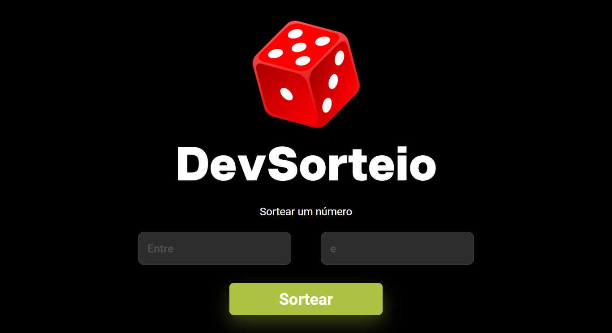

# DevSorteio 🎲

>DevClub

Projeto proposto na plataforma DevClub para treino da ferramenta Math.random(). A aplicação permite sortear qualquer valor entre um range específico, com apenas uma regra: o primeiro valor inserido deve ser menor do que o segundo valor.

🔗 [Clique aqui para acessar](https://alineguiseline.github.io/dev-sorteio/)

## Tecnologias utilizadas
- HTML  
- CSS  
- JavaScript Vanilla

## Contato 💜
[LinkedIn](https://www.linkedin.com/in/alineguiseline)
